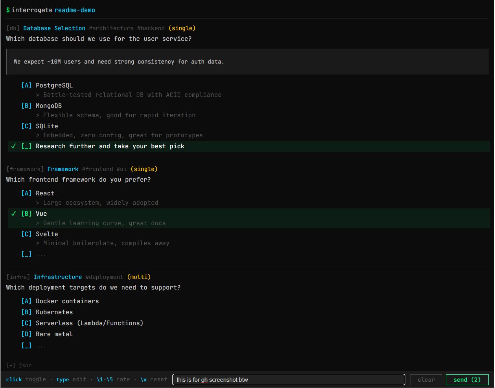

# Human Interrogation Tool

Async questionnaire system for human-in-the-loop AI workflows. An LLM posts markdown-formatted questions to an HTTP API, a human answers via web UI, and the LLM polls for responses.



## Quick Start

```bash
bun install
bun run server.ts
```

Server runs on `http://localhost:4242`.

## How It Works

1. **LLM posts questions** to `/api/conversation/{id}/ask.md`
2. **Human answers** at `http://localhost:4242/v/{id}`
3. **LLM polls** `/api/conversation/{id}/wait.md` for responses

## Question Format

Questions use a markdown-based format:

```markdown
#architecture #backend
[Database Selection] (single)
**db**: Which database should we use?
Context and background info goes here.
[A] PostgreSQL
    > Battle-tested, ACID compliant
[B] MongoDB
    > Flexible schema, good for iteration
[C] SQLite
    > Embedded, zero config
```

| Element | Syntax | Required |
|---------|--------|----------|
| Tags | `#tag` | No |
| Label | `[Label]` | No |
| Mode | `(single)` or `(multi)` | No |
| Question ID | `**id**:` | No (auto-generated) |
| Question text | After ID | Yes |
| Context | Lines before options | No |
| Option | `[A] text` | Yes (at least one) |
| Description | `> text` under option | No |

Separate multiple questions with `---`.

## API Endpoints

All endpoints under `/api/conversation/{id}/`:

| Endpoint | Method | Description |
|----------|--------|-------------|
| `ask.md` | POST | Submit questions (markdown body) |
| `wait.md` | GET | Long-poll for answers (5 min timeout) |
| `answers.md` | GET | Get all answers immediately |

### Example: Ask Questions

```bash
curl -X POST http://localhost:4242/api/conversation/my-session/ask.md \
  -H "Content-Type: text/plain" \
  -d '**q1**: Should we proceed?
[A] Yes
[B] No'
```

### Example: Wait for Answers

```bash
curl http://localhost:4242/api/conversation/my-session/wait.md
```

Returns markdown with YAML frontmatter:

```yaml
---
conversation: my-session
pending: []
unread: []
---

**q1**: Should we proceed?
- [A] Yes
```

## Human Interface Features

- Click options to select/deselect
- Edit option text for custom responses
- Add new options with `[_] ...`
- Emoji shortcuts: `\yes`, `\no`, `\1`-`\5` for ratings
- Ctrl+Enter to send

## Claude Code Skill

This tool ships as a [Claude Code skill](https://docs.anthropic.com/en/docs/claude-code/skills). Copy `skill.md` to your skills directory to enable the `/interrogate` command.

## License

MIT
